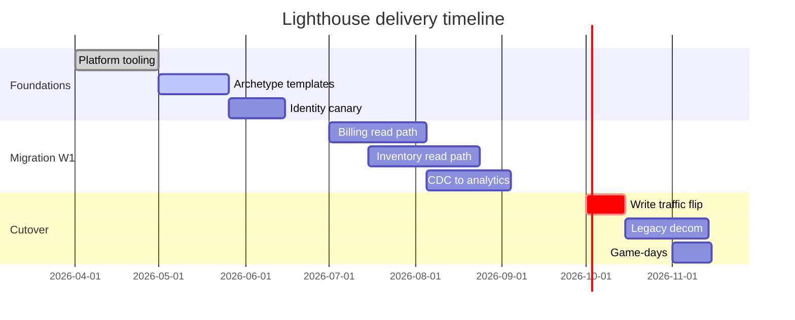

# Project Lighthouse — Strategic Plan

> *"Plans are nothing; planning is everything."* — Dwight D. Eisenhower

**Status:** `Draft v3.1` &nbsp;·&nbsp; **Owner:** Strategy Guild &nbsp;·&nbsp; **Last review:** 2026‑05‑13

---

## Table of Contents

1. [Executive Summary](#executive-summary)
2. [Objectives & Key Results](#objectives--key-results)
3. [Architecture Overview](#architecture-overview)
4. [Roadmap](#roadmap)
5. [Engineering Practices](#engineering-practices)
6. [Risk Register](#risk-register)
7. [Appendix](#appendix)

---

## Executive Summary

**Project Lighthouse** is an initiative to consolidate three legacy back‑office systems into a single, observable, event‑driven platform. We expect to:

- Cut operational costs by **~38%** within two fiscal years.
- Reduce mean‑time‑to‑recovery (MTTR) from **47 min → 8 min**.
- Deliver a unified API surface for ~120 downstream consumers.

> ⚠️ This document is a **living plan**. Sections marked *TBD* require sign‑off from the architecture board before the next quarterly review.

---

## Objectives & Key Results

### O1 — Modernise the data plane

| KR  | Description                                  | Baseline | Target | Owner   |
|:---:|:---------------------------------------------|:--------:|:------:|:--------|
| 1.1 | Migrate transactional store to Postgres 16   |   0%     |  100%  | @diana  |
| 1.2 | Adopt CDC for downstream replication         |   —      |  Live  | @theo   |
| 1.3 | p99 read latency under sustained load        | 410 ms   | 80 ms  | @marina |

### O2 — Elevate developer experience

- [x] Standardise CI on a single reusable workflow
- [x] Provide a one‑command local environment (`make up`)
- [ ] Ship golden‑path templates for **3** service archetypes
- [ ] Reduce median PR review time below **4 hours**

### O3 — Build trust through observability

- [ ] 100% of services emit OpenTelemetry traces
- [ ] Every alert has a documented runbook
- [ ] SLO dashboards published for the **top 12** user journeys

---

## Architecture Overview

The platform follows a **hexagonal**, event‑first design. Each bounded context owns its data and communicates via a durable log.

```
            ┌─────────────────────┐        ┌────────────────────┐
   HTTP ──▶ │   Edge Gateway      │ ──────▶│  Identity Service  │
            └──────────┬──────────┘        └─────────┬──────────┘
                       │                              │
                       ▼                              ▼
            ┌─────────────────────┐        ┌────────────────────┐
            │   Command Router    │ ──────▶│   Event Backbone   │◀── CDC ──┐
            └──────────┬──────────┘        └─────────┬──────────┘          │
                       │                              │                     │
                       ▼                              ▼                     │
                ┌────────────┐               ┌────────────────┐      ┌──────┴──────┐
                │  Billing   │               │   Inventory    │      │  Analytics  │
                └────────────┘               └────────────────┘      └─────────────┘
```

### Component responsibilities

| Component        | Responsibility                                | Tech stack                |
|:-----------------|:----------------------------------------------|:--------------------------|
| Edge Gateway     | TLS termination, auth, request shaping        | Envoy, OPA                |
| Identity Service | Tokens, sessions, MFA                         | Go, Redis, Postgres       |
| Command Router   | Validates and routes write intents            | Rust, Kafka               |
| Event Backbone   | Durable event log, exactly‑once semantics     | Kafka 3.7, Schema Registry|
| Billing          | Invoicing, dunning, revenue recognition       | Kotlin, Postgres          |
| Inventory        | Stock, reservations, replenishment            | Go, CockroachDB           |
| Analytics        | OLAP, dashboards, ad‑hoc exploration          | ClickHouse, dbt           |

---

## Roadmap

### Q2 2026 — *Foundations*

> **Theme:** *"Pave the road before driving the truck."*

- Stand up shared platform tooling (CI, IaC, secrets, observability).
- Publish service archetype templates.
- Migrate the **Identity** context as the canary.

### Q3 2026 — *Migration wave 1*

> **Theme:** *"Move the easy things first; learn loudly."*

- Migrate **Billing** and **Inventory** read paths.
- Introduce CDC pipeline to the analytics estate.
- Begin deprecation of `legacy-monolith-v2`.

### Q4 2026 — *Cutover*

> **Theme:** *"Burn the boats."*

- Flip write traffic to the new platform behind feature flags.
- Decommission three legacy databases.
- Run two full game‑days, including a regional failover drill.

### Milestone timeline



---

## Engineering Practices

### Coding standards

We favour **boring, predictable code** over clever code. The bar is simple:

1. *Would a new joiner understand this in one read?*
2. *Does it fail loudly when assumptions break?*
3. *Is the unit of change small enough to revert without ceremony?*

#### Example — idiomatic service handler (Go)

```go
// CreateInvoice handles POST /invoices. It is intentionally thin:
// validation lives in the request type, persistence in the repository,
// and business rules in the domain package.
func (h *Handler) CreateInvoice(w http.ResponseWriter, r *http.Request) {
    var req CreateInvoiceRequest
    if err := json.NewDecoder(r.Body).Decode(&req); err != nil {
        writeProblem(w, http.StatusBadRequest, "invalid_payload", err)
        return
    }
    if err := req.Validate(); err != nil {
        writeProblem(w, http.StatusUnprocessableEntity, "invalid_request", err)
        return
    }

    inv, err := h.invoices.Create(r.Context(), req.ToDomain())
    if err != nil {
        h.log.Error("create invoice", "err", err)
        writeProblem(w, http.StatusInternalServerError, "internal", err)
        return
    }

    w.Header().Set("Location", "/invoices/"+inv.ID)
    w.WriteHeader(http.StatusCreated)
    _ = json.NewEncoder(w).Encode(inv)
}
```

#### Example — derived analytics query (SQL)

```sql
WITH recent_orders AS (
    SELECT
        customer_id,
        date_trunc('day', placed_at) AS day,
        SUM(total_cents) / 100.0     AS revenue
    FROM   orders
    WHERE  placed_at >= NOW() - INTERVAL '30 days'
    GROUP  BY 1, 2
)
SELECT
    customer_id,
    AVG(revenue)                                       AS avg_daily_revenue,
    PERCENTILE_CONT(0.95) WITHIN GROUP (ORDER BY revenue) AS p95_daily_revenue
FROM   recent_orders
GROUP  BY customer_id
HAVING AVG(revenue) > 250
ORDER  BY avg_daily_revenue DESC
LIMIT  100;
```

#### Example — infrastructure (HCL)

```hcl
module "lighthouse_cluster" {
  source  = "registry.internal/platform/eks/aws"
  version = "~> 4.2"

  name               = "lighthouse-prod"
  kubernetes_version = "1.30"

  node_groups = {
    general = {
      instance_types = ["m6i.xlarge"]
      min_size       = 6
      max_size       = 30
      labels         = { workload = "general" }
    }
    bursty = {
      instance_types = ["c7i.2xlarge"]
      min_size       = 0
      max_size       = 40
      taints         = [{ key = "bursty", value = "true", effect = "NO_SCHEDULE" }]
    }
  }
}
```

### Definition of Done

A change is **done** only when *all* of the following are true:

- [x] Tests at the appropriate level (unit, contract, integration) are green.
- [x] Telemetry — logs, metrics, traces — has been added or updated.
- [x] A runbook exists for any new alert.
- [x] Documentation is updated *in the same pull request*.
- [x] The author has reviewed the diff one more time after the bot's comments.

---

## Risk Register

| ID  | Risk                                                | Likelihood | Impact | Mitigation                                       |
|:---:|:----------------------------------------------------|:----------:|:------:|:-------------------------------------------------|
| R1  | Schema drift between legacy and new stores          | Medium     | High   | CDC + automated drift detector, hourly           |
| R2  | Vendor lock‑in on managed Kafka                     | Low        | Medium | Abstract via adapter; quarterly portability test |
| R3  | Skill gap on Rust within the routing team           | High       | Medium | Pair‑programming rotation; targeted training     |
| R4  | Cutover coincides with peak retail season           | Medium     | High   | Move cutover to early November; freeze December  |
| R5  | ~~Single‑region dependency on us‑east‑1~~ *retired* | —          | —      | Resolved by multi‑region active/active rollout   |

> 💡 **Heuristic:** if a risk has *no named owner*, it does not exist on paper — and therefore it does not exist in reality. Every row above must have an owner before the next steering meeting.

---

## Decision Log (selected)

1. **ADR‑014 — Adopt Postgres over MySQL for transactional workloads.**
   *Rationale:* richer type system, mature logical replication, stronger ecosystem for analytics tooling.
2. **ADR‑017 — Use a single event backbone instead of per‑context buses.**
   *Rationale:* lower operational surface, easier cross‑context analytics, acceptable blast‑radius with topic‑level ACLs.
3. **ADR‑022 — Prefer feature flags over long‑lived branches.**
   *Rationale:* shorter integration cycles; production‑like rehearsal of new behaviour.

---

## Appendix

### A. Glossary

- **Bounded context** — a self‑contained slice of the domain with its own model and language.
- **CDC** — *Change Data Capture*: emitting database changes as a stream of events.
- **Golden path** — an opinionated, well‑lit route for building a service end‑to‑end.
- **SLO** — *Service Level Objective*: a measurable promise to users.

### B. Useful links

- Architecture review board → [arb.internal](https://arb.internal)
- Platform handbook → [handbook.internal/platform](https://handbook.internal/platform)
- Incident runbooks → [runbooks.internal](https://runbooks.internal)

### C. Math, just for fun

The expected error budget burn for an SLO with availability target $A$ over a window of $N$ minutes is:

$$
B(t) \;=\; \frac{\sum_{i=1}^{t} \mathbb{1}\{\text{bad}_i\}}{N \cdot (1 - A)}
$$

When $B(t) > 1$, the budget is exhausted and we **stop shipping non‑critical changes** until it recovers.

### D. Closing note

> *Ship small. Measure honestly. Write things down. Repeat.*

— *The Strategy Guild*
